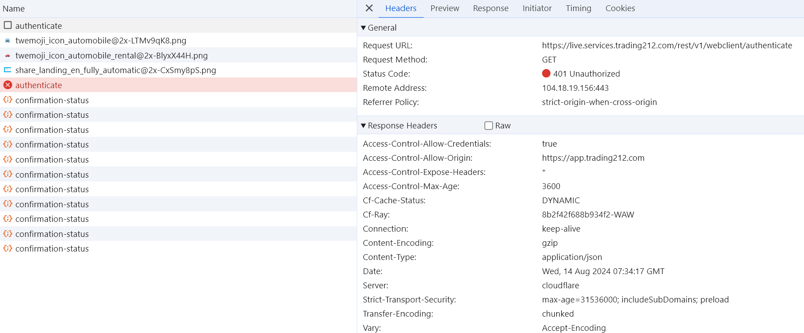

# Trading 212 API for TypeScript

  

---

## Motivation

This [Trading 212](https://www.trading212.com/) API can be used with TypeScript and comes with many useful features such as automatic reconnects and response validation.

## Implemented Endpoints

- [x] [Account Data](https://t212public-api-docs.redoc.ly/#tag/Account-Data)
- [x] [Equity Orders](https://t212public-api-docs.redoc.ly/#tag/Equity-Orders)
- [x] [Historical items](https://t212public-api-docs.redoc.ly/#tag/Historical-items)
- [x] [Instruments Metadata](https://t212public-api-docs.redoc.ly/#tag/Instruments-Metadata)
- [x] [Personal Portfolio](https://t212public-api-docs.redoc.ly/#tag/Personal-Portfolio)
- [x] [Pies](https://t212public-api-docs.redoc.ly/#tag/Pies)

## Features

- ✅ **Documented.** Get started with [demo scripts][1] and [generated documentation][2].
- ✅ **Maintained.** Automated security updates. No threats from outdated dependencies.
- ✅ **Modern.** HTTP client with Promise API. Don't lose yourself in callback hell.
- ✅ **Reliable.** Follows [semantic versioning][3]. Get notified about breaking changes.
- ✅ **Robust.** Automatic requests retries are built-in. No problems if your Wi-Fi is gone.
- ✅ **Tested.** Unit test coverage to guarantee core functionaly.
- ✅ **Typed.** Source code is 100% TypeScript. No need to install external typings.

## Usage

### Installation

**npm**

```bash
npm install trading212-api
```

### REST Example

The [demo section][1] provides many examples on how to use "trading212-api". There is also an automatically generated [API documentation][2]. For a quick start, here is a simple example for a REST request:

```ts
import {APIClient} from 'trading212-api';

const baseURL = APIClient.URL_LIVE;
const client = new APIClient(baseURL, 'apiKey');

const info = await client.rest.account.getInfo();
console.log(info);
```

### API Key Generation

In order to generate an API key, you can follow the [official instructions](https://helpcentre.trading212.com/hc/en-us/articles/14584770928157). Basically, you need to [login](https://app.trading212.com/), click on your account and do the following:

1. Click "Switch to Practice" in order to generate an API key for the demo code, otherwise a live API key will be generated
2. Go to "Settings"
3. Click on "API (Beta)"

### Development

If cloning the project locally, you can also add a `.env` file to configure the API client (see [.env.defaults][4]). This allows you to run all demo scripts.

**Example**

```bash
npm run demo:account
```

## Browser API

The official Trading212 API does not support placing orders in a live environment. To address this, the library includes an experimental Browser API that uses a headless Chrome browser for programmatic trading.

The Browser API will need to log in with your username and password, so ensure you set the following environment parameters in your `.env` file:

```bash
TRADING212_HEADLESS_BROWSER=false
TRADING212_EMAIL=name@mail.com
TRADING212_PASSWORD=secret
```

This technique will log in locally using your credentials and save them in the "[credentials](./credentials/)" directory. This prevents unnecessary re-logins, as the login token remains valid for the session.

Here's how to use the Browser API:

```ts
import {initClient} from 'trading212-api';

const client = await initClient();

const accountSummary = await client.browser.accounts.getSummary();
console.log(accountSummary.cash.free);
```

Locally you can test it with:

```bash
npm start
```

### Discoveries

The Trading212 Browser API will show this error when submitting an empty object (`{}`):

> data: { code: 'InternalError' }

To fix it, we have to submit an empty array (`[]`):

```ts
await axios.post<AccountSummary>(ACCOUNT_SUMMARY_URL, [], {
  headers: {
    ...auth.headers,
    Cookie: toCookieString(cookies),
    'User-Agent': getUserAgent(),
    'X-Trader-Client': `application=WC4, version=1.0.0, dUUID=${duuid}`,
  },
});
```

When the "credentials" are wrong or expired, the API will show:

```json
{
  "code": "AuthenticationFailed",
  "context": {
    "type": "InvalidSession"
  },
  "errorMessage": "Invalid account session cookie"
}
```

In such cases, simply delete the "[credentials](./credentials/)" directory and try again.

The Browser API is build on findings from the article "[I Reverse-Engineered Trading212’s Web APIs ](https://haksoat.com/reverse-engineering-trading212/)". You can find the matching Python code in the [TradingTOT library](https://github.com/HAKSOAT/tradingTOT) on GitHub.

> [!CAUTION] The Trading212 Browser API is quite unstable. Even on their web client, authentication requests sometimes fail while other requests succeed.



## Internals

This library utilizes [axios](https://github.com/axios/axios) for HTTP calls. You can configure the axios instance using [interceptors](https://axios-http.com/docs/interceptors) if needed. Retries are handled by [axios-retry](https://github.com/softonic/axios-retry), and payloads are validated with [Zod](https://github.com/colinhacks/zod). Unit tests are implemented with [nock](https://github.com/nock/nock) and the headless browser is controlled via [Playwright](https://playwright.dev/).

## Contributions

Here are some best practices PRs that show how to add endpoints:

- [Add Pie API](https://github.com/bennycode/trading212-api/pull/6/files)

## Resources

### Documentation

- [Docs: Trading212 API](https://t212public-api-docs.redoc.ly/)
- [Forum: New Equity Trading API in Beta](https://community.trading212.com/t/61788)
- [Blog: Reverse-Engineered Trading212’s Web APIs](https://haksoat.com/reverse-engineering-trading212/)

### Tools

- [JSON to Zod Schema](https://transform.tools/json-to-zod)
- [OpenAPI Generator: Global Properties](https://openapi-generator.tech/docs/globals/)
- [OpenAPI Generator: Config Options](https://openapi-generator.tech/docs/generators/typescript-fetch/#config-options)

### Others

- [Python-based Trading212 API](https://github.com/HAKSOAT/tradingTOT)

[1]: https://github.com/bennycode/trading212-api/tree/main/src/demo
[2]: https://github.com/bennycode/trading212-api/tree/main/docs
[3]: https://docs.npmjs.com/about-semantic-versioning
[4]: https://github.com/bennycode/trading212-api/blob/main/.env.defaults
